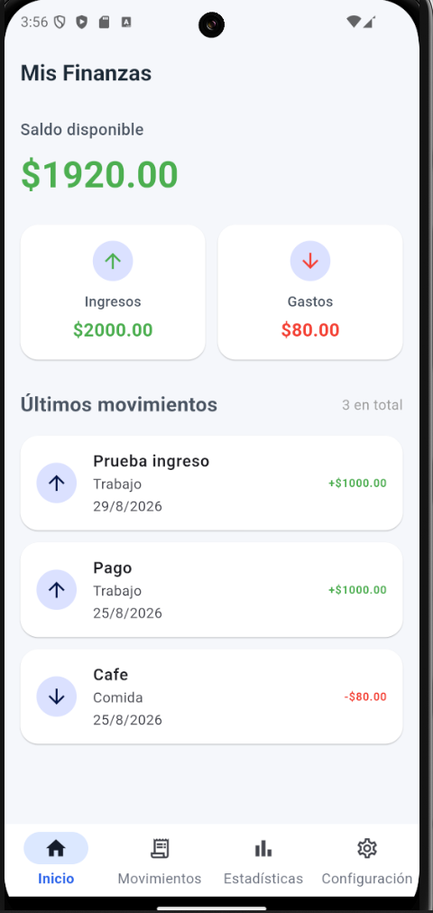
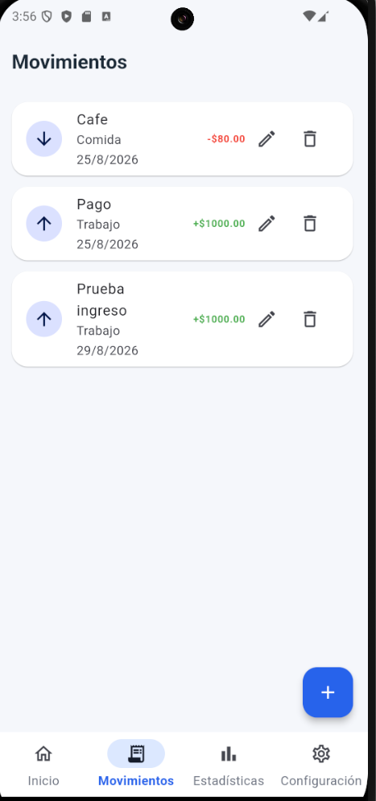
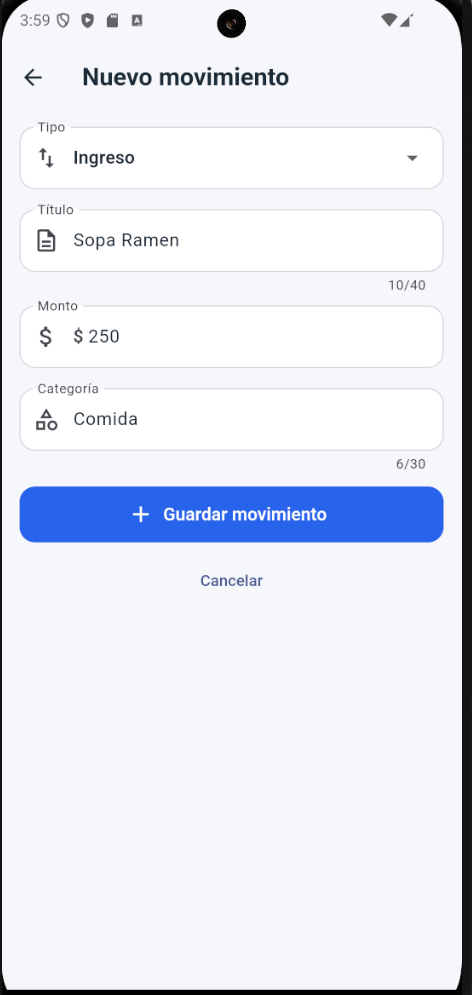
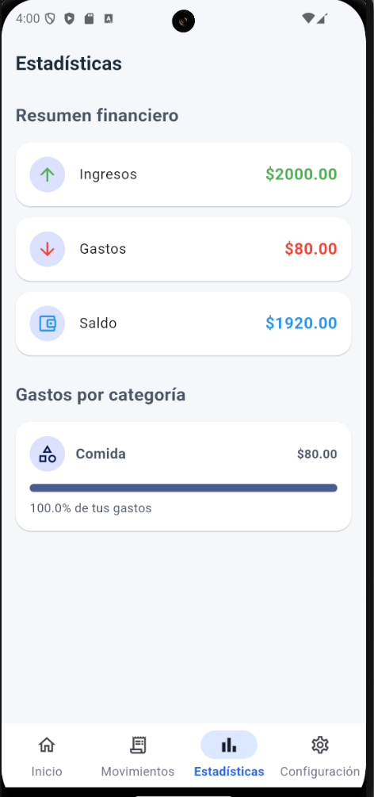
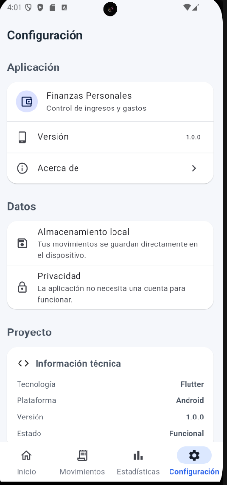

# 💰 Finanzas Personales

Aplicación móvil desarrollada con Flutter para registrar y consultar ingresos y gastos personales de forma sencilla.

El proyecto permite llevar un control básico de las finanzas personales directamente desde un dispositivo Android, almacenando la información de manera local.

---

## 📱 Funcionalidades

- Registrar ingresos.
- Registrar gastos.
- Editar movimientos existentes.
- Eliminar movimientos.
- Guardar los movimientos de manera local.
- Consultar saldo disponible.
- Consultar total de ingresos.
- Consultar total de gastos.
- Visualizar los últimos movimientos.
- Consultar estadísticas financieras.
- Visualizar gastos agrupados por categoría.
- Validación de formularios.
- Navegación mediante barra inferior.
- Pantalla de configuración e información de la aplicación.

---

## 📊 Pantallas principales

La aplicación cuenta con cuatro secciones principales:

### 🏠 Inicio

Muestra un resumen general de las finanzas:

- Saldo disponible.
- Total de ingresos.
- Total de gastos.
- Últimos movimientos registrados.

### 🧾 Movimientos

Permite administrar los ingresos y gastos.

Cada movimiento contiene:

- Tipo: ingreso o gasto.
- Título.
- Monto.
- Categoría.
- Fecha.

Desde esta pantalla es posible:

- Crear movimientos.
- Editar movimientos.
- Eliminar movimientos.

### 📈 Estadísticas

Muestra información obtenida a partir de los movimientos registrados:

- Total de ingresos.
- Total de gastos.
- Saldo.
- Gastos agrupados por categoría.
- Porcentaje que representa cada categoría dentro de los gastos.

### ⚙️ Configuración

Incluye información general y técnica de la aplicación.

---

## 💾 Almacenamiento local

Los movimientos se almacenan localmente en el dispositivo utilizando:

```text
shared_preferences
```

Los datos son convertidos a JSON antes de ser almacenados.

Esto permite conservar los movimientos aunque la aplicación sea cerrada y abierta nuevamente.

---

## 🛠️ Tecnologías utilizadas

- Flutter
- Dart
- Material Design 3
- SharedPreferences
- JSON
- Android
- Visual Studio Code
- Android Studio

---

## 📂 Estructura principal

```text
lib/
│
├── models/
│   └── transaction.dart
│
├── navigation/
│   └── main_navigation.dart
│
├── screens/
│   ├── home_screen.dart
│   ├── transactions_screen.dart
│   ├── add_transaction_screen.dart
│   ├── statistics_screen.dart
│   └── settings_screen.dart
│
├── services/
│   └── transaction_service.dart
│
├── theme/
│   └── app_theme.dart
│
├── widgets/
│
└── main.dart
```

---

## ▶️ Ejecutar el proyecto

### 1. Clonar el repositorio

```bash
git clone URL_DEL_REPOSITORIO
```

### 2. Entrar al proyecto

```bash
cd finanzas_personales
```

### 3. Instalar las dependencias

```bash
flutter pub get
```

### 4. Comprobar los dispositivos disponibles

```bash
flutter devices
```

### 5. Ejecutar la aplicación

```bash
flutter run
```

---

## ✅ Validaciones

El formulario evita guardar movimientos cuando:

- El título está vacío.
- El monto está vacío.
- El monto no es válido.
- El monto es igual o menor a cero.
- La categoría está vacía.

---

## 🧪 Pruebas realizadas

Se comprobaron las siguientes operaciones:

- Creación de ingresos.
- Creación de gastos.
- Edición de movimientos.
- Eliminación de movimientos.
- Actualización de los totales.
- Actualización de las estadísticas.
- Persistencia después de cerrar la aplicación.
- Validación de campos incorrectos o vacíos.
- Navegación entre las diferentes pantallas.

---

## 📸 Capturas

### Inicio



### Movimientos



### Nuevo movimiento



### Estadísticas



### Configuración



---

## 🎯 Objetivo del proyecto

Este proyecto fue desarrollado como parte de mi portafolio profesional con el objetivo de practicar y demostrar conocimientos en desarrollo de aplicaciones móviles utilizando Flutter y Dart.

Entre los conceptos aplicados se encuentran:

- Desarrollo de interfaces móviles.
- Navegación entre pantallas.
- Manejo de formularios.
- Validación de datos.
- Programación orientada a objetos.
- Persistencia local.
- Manejo de listas y modelos.
- Organización de proyectos Flutter.
- Diseño con Material Design.

---

## 📌 Estado

```text
Versión: 1.0.0
Estado: Funcional
Plataforma: Android
```

---

## 👨‍💻 Autor

**Jahdiel Adrián Tzec Navarrete**

Estudiante de Ingeniería en Sistemas Computacionales.

---

## 📄 Licencia

Proyecto desarrollado con fines educativos y de portafolio profesional.